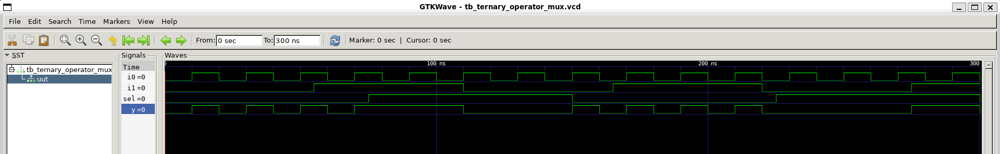
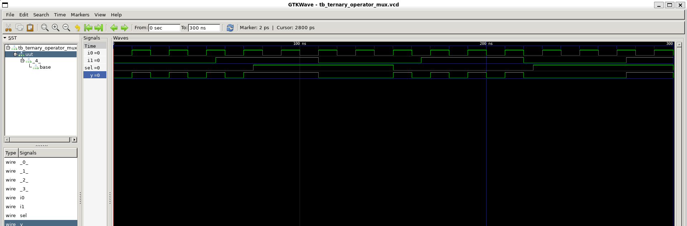
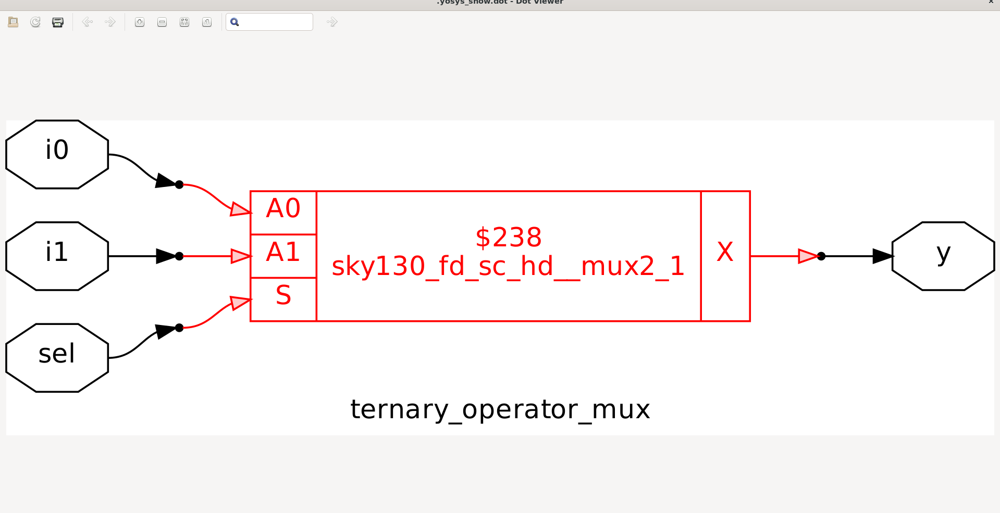
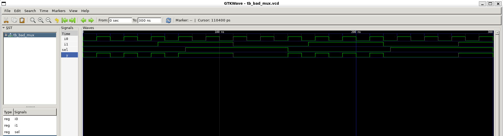
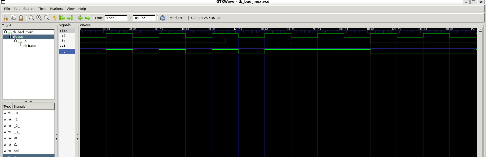
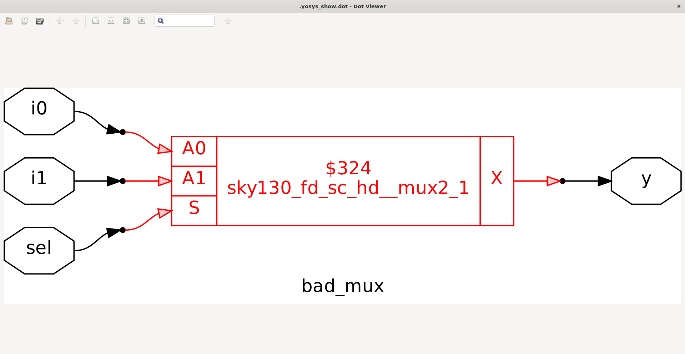
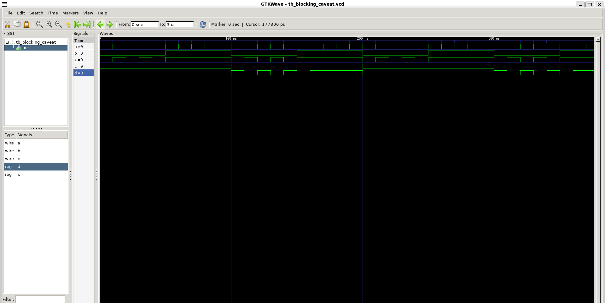
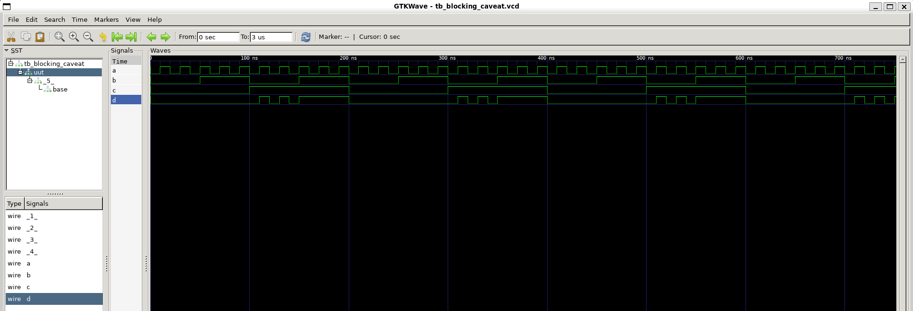
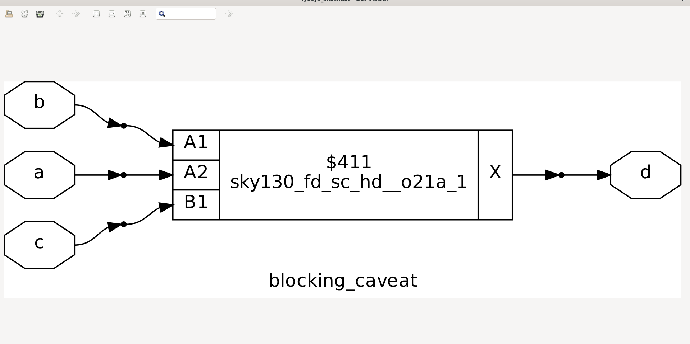

# Day-4 – Gate-Level Simulation (GLS)


---

## ✨ What is Gate-Level Simulation (GLS)?

Gate-Level Simulation (GLS) is the process of **simulating a synthesized netlist** (post-synthesis) using the same testbench (TB) that was used for RTL simulation.

* **Netlist ≈ RTL (logically)**, but includes **actual gate implementations**.
* **Why use the same TB?** To verify **logical correctness** after synthesis and to ensure **timing constraints are met**.

### Delay Annotation

* **Timing-aware netlists** include **propagation delays from synthesis**, allowing accurate timing analysis.
* **Functional gate-level models** ignore timing, focusing only on logic correctness.

---

## 📌 Gate-Level Verilog Models

1. **Timing-Aware**

   * Includes **logic function + gate delays**
   * Used for **functional and timing verification**

2. **Functional**

   * Only models **logic functionality**
   * Used for **functional verification only** (no timing info)

---

## 📌 Causes of Synthesis vs Simulation Mismatches

GLS may differ from RTL simulation due to:

### **1. Ternary Operator Multiplexer**

* Example – RTL using ternary operator:

```verilog
assign out = sel ? I0 : I1;
```

* **Observation:** Logic is simple, but post-synthesis, the netlist may differ slightly in gates and delay.
* **Why simulate GLS?** To ensure **functionality matches RTL** even after gate mapping.

**Images:**





---

### **2. Missing Sensitivity List**

* Example – bad multiplexer:

```verilog
always @(sel)
begin
    out = sel ? I0 : I1;
end
```

* **Problem:** Changes in `I0` or `I1` don’t trigger the block → mismatch.
* **Fix:** Use `always @(*)` for combinational logic.

**Images:**





---

### **3. Blocking vs Non-Blocking Assignments**

* **Blocking (`=`)** – executes **line by line**, suitable for combinational logic

* **Non-Blocking (`<=`)** – executes **in parallel at the end of time step**, suitable for sequential logic

* **Example – Blocking in combinational logic**

```verilog
always @(*)
begin
    d = c & c;
    x = a | b;
end
```

* **Effect:** Assignments execute sequentially → `d` updates before `x`. In complex logic, this may cause **incorrect intermediate values** and **simulation mismatches** with the synthesized netlist.
* **Best Practice:**

  * Use **non-blocking assignments** for sequential logic
  * Ensure **`always @(*)`** for combinational blocks

**Images:**





---

### **4. Non-Standard Verilog Constructs**

* Using **non-synthesizable constructs** in RTL can cause mismatches post-synthesis.
* Always ensure RTL code is **synthesizable and standard-compliant**.

---

## ✅ Conclusion

* GLS ensures that **synthesized netlists behave correctly**.
* Common mismatch causes:

  1. Ternary operator netlist differences
  2. Missing sensitivity lists
  3. Blocking vs non-blocking misuse
  4. Non-standard Verilog
* **Best practice:** Always use **timing-aware GLS** for final verification before FPGA or ASIC implementation.


