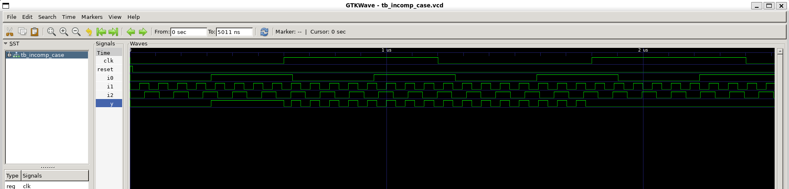
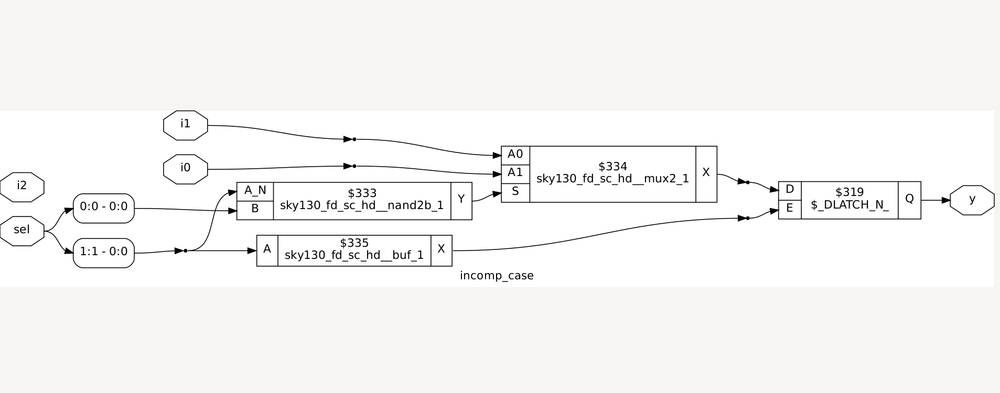
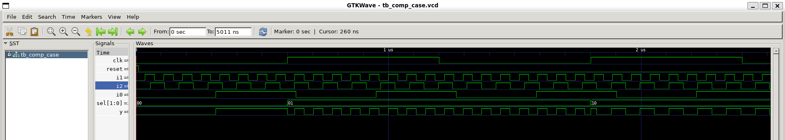
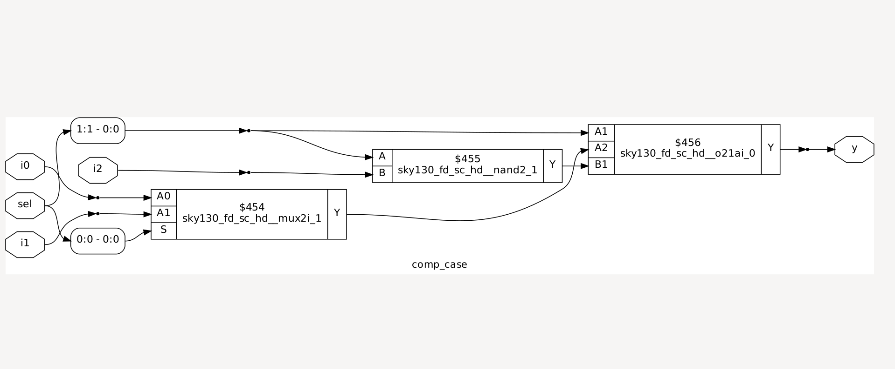
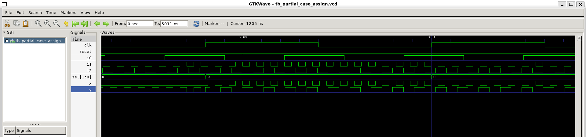
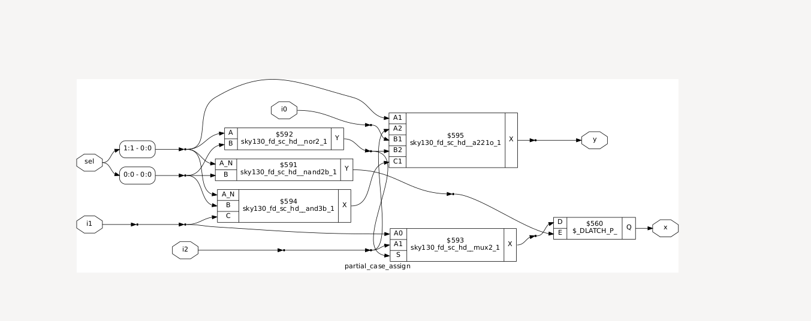
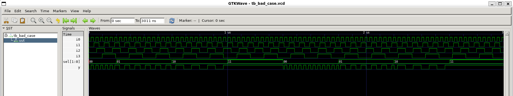
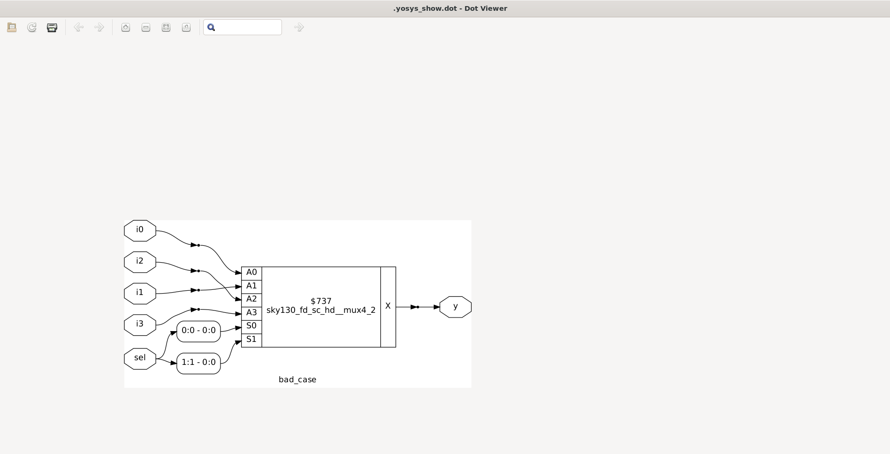

# Case Statements


---

## ✨ What is a `case` Statement?

`case` statements in Verilog are used for **multi-way selection** inside `always` blocks:

```verilog
case(sel)
    2'b00: y = i0;
    2'b01: y = i1;
    default: y = i2;
endcase
```

* Evaluates the **selector (`sel`)** and executes the matching branch.
* `default` covers **all unspecified cases**, preventing unintended latches.

---

## ⚠️ Caveats of Case Statements

1. **Incomplete Case**

   * If **all possible selector values are not covered**, a **latch may be inferred**.
2. **Partial Case**

   * Some outputs are assigned only in certain branches → other outputs may latch.
3. **Bad Case / Overlapping / Wildcards**

   * Using wildcards or overlapping branches can cause **unexpected behavior in synthesis**.

---

## 📌 Example 1 – Incomplete Case

```verilog
module incomp_case (input i0 , input i1 , input i2 , input [1:0] sel, output reg y);
always @(*)
begin
    case(sel)
        2'b00 : y = i0;
        2'b01 : y = i1;
    endcase
end
endmodule
```

* **Problem:** No coverage for `2'b10` or `2'b11` → **inferred latch for y**
* **Simulation:** Works only for defined cases; holds previous value otherwise
* **Synthesis:** D-latch inferred

**Images:**



---

## 📌 Example 2 – Complete Case

```verilog
module comp_case (input i0 , input i1 , input i2 , input [1:0] sel, output reg y);
always @(*)
begin
    case(sel)
        2'b00 : y = i0;
        2'b01 : y = i1;
        default : y = i2;
    endcase
end
endmodule
```

* **Solution:** Default ensures **all cases are covered** → no latches inferred
* **Simulation:** Works for all selector values
* **Synthesis:** Only combinational logic, no latches

**Images:**



---

## 📌 Example 3 – Partial Case Assignment

```verilog
module partial_case_assign (input i0 , input i1 , input i2 , input [1:0] sel, output reg y , output reg x);
always @(*)
begin
    case(sel)
        2'b00 : begin
            y = i0;
            x = i2;
        end
        2'b01 : y = i1;
        default : begin
            x = i1;
            y = i2;
        end
    endcase
end
endmodule
```

* **Problem:** `x` not assigned in `2'b01` branch → **inferred latch for x**
* **Simulation:** `x` holds previous value when `sel=2'b01`
* **Synthesis:** D-latch inferred for `x`, `y` is safe

**Images:**



---

## 📌 Example 4 – Bad Case / Wildcard

```verilog
module bad_case (input i0 , input i1, input i2, input i3 , input [1:0] sel, output reg y);
always @(*)
begin
    case(sel)
        2'b00: y = i0;
        2'b01: y = i1;
        2'b10: y = i2;
        2'b1?: y = i3;
        //2'b11: y = i3;
    endcase
end
endmodule
```

* **Problem:** Wildcard `2'b1?` may **overlap with other branches** and the commented branch causes **ambiguity**
* **Simulation:** Works but behavior may not be fully predictable
* **Synthesis:** Tools may infer **latches or unpredictable logic** depending on coverage

**Images:**



---

## ✅ Best Practices

1. **Always cover all possible selector values** → use `default` if necessary.
2. For multi-output cases, **ensure every output is assigned in every branch**.
3. Avoid **overlapping cases or wildcards** unless intended.
4. Use `always @(*)` for combinational logic.

---

## 📝 Conclusion

* **Incomplete or partial case statements** can lead to **inferred latches**.
* **Complete cases with default branches** prevent unintended memory elements.
* **Bad/wildcard cases** can cause **unpredictable synthesis results**.
* **Simulation vs Synthesis:** Always verify **all branches and outputs** to ensure correctness.

---

