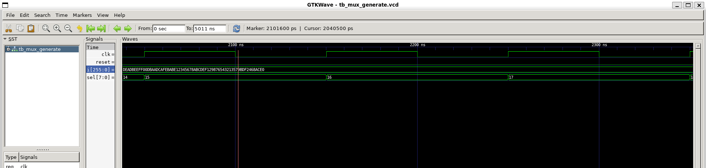
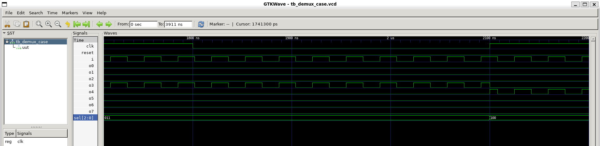
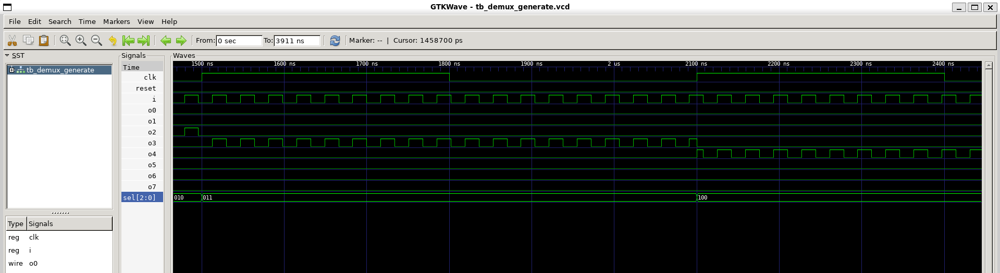
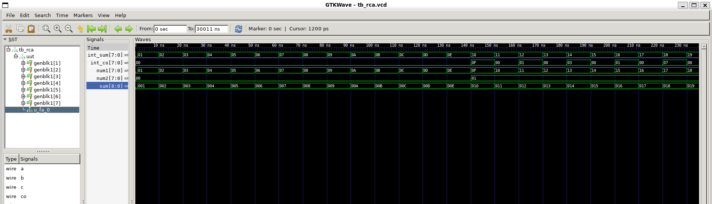

# Day-5 – For Loop & Generate For Loop


---

## ✨ What is a `for` Loop?

* The **`for` loop** in Verilog allows **repetitive execution** of statements in an `always` block.
* Syntax:

```verilog
for (initialization; condition; increment) begin
    // statements
end
```

* Useful for **multi-bit operations, bus manipulations, and repetitive logic**.

---

## ✨ What is a `generate` For Loop?

* **`generate` loops** are used **outside procedural blocks** (at module level) to instantiate **multiple module instances**.
* Useful for **structural replication**, e.g., building multi-bit adders, muxes, or arrays of modules.

```verilog
genvar i;
generate
    for(i = 0; i < N; i=i+1) begin : block_name
        // module instantiation or assignment
    end
endgenerate
```

---

## 🧪 Lab Work

### **1. 256-to-1 MUX Using `for` Loop**

```verilog
module mux_generate (
    input  [255:0] i,        // 256 inputs bundled as a bus
    input  [7:0]   sel,      // 8-bit select line (0–255)
    output reg     y
);

    integer k;

    always @(*) begin
        y = 1'b0;   // default assignment
        for (k = 0; k < 256; k = k + 1) begin
            if (k == sel)
                y = i[k];
        end
    end

endmodule
```

* **Explanation:** Loops over 256 inputs and selects the one indicated by `sel`.
* **Result:**
  

---

### **2. 8-to-1 Demux Using `case`**

```verilog
module demux_case (
    output o0 , output o1, output o2 , output o3,
    output o4, output o5, output o6 , output o7,
    input [2:0] sel, input i
);
reg [7:0] y_int;
assign {o7,o6,o5,o4,o3,o2,o1,o0} = y_int;

always @(*) begin
    y_int = 8'b0;
    case(sel)
        3'b000 : y_int[0] = i;
        3'b001 : y_int[1] = i;
        3'b010 : y_int[2] = i;
        3'b011 : y_int[3] = i;
        3'b100 : y_int[4] = i;
        3'b101 : y_int[5] = i;
        3'b110 : y_int[6] = i;
        3'b111 : y_int[7] = i;
    endcase
end
endmodule
```

* **Result:**
  

---

### **3. 8-to-1 Demux Using `for` Loop**

```verilog
module demux_generate (
    output o0 , output o1, output o2 , output o3,
    output o4, output o5, output o6 , output o7,
    input [2:0] sel, input i
);
reg [7:0] y_int;
assign {o7,o6,o5,o4,o3,o2,o1,o0} = y_int;
integer k;

always @(*) begin
    y_int = 8'b0;
    for(k = 0; k < 8; k = k + 1) begin
        if(k == sel)
            y_int[k] = i;
    end
end
endmodule
```

* **Observation:** Produces same functionality as `case` version but **reduces repetitive code**.
* **Result:**
  

---

### **4. 8-bit Ripple Carry Adder Using `generate` For Loop**

```verilog
module rca (
    input [7:0] num1 , input [7:0] num2 , 
    output [8:0] sum
);
wire [7:0] int_sum;
wire [7:0] int_co;

genvar i;
generate
    for (i = 1; i < 8; i = i + 1) begin
        fa u_fa_1 (.a(num1[i]),.b(num2[i]),.c(int_co[i-1]),.co(int_co[i]),.sum(int_sum[i]));
    end
endgenerate

fa u_fa_0 (.a(num1[0]),.b(num2[0]),.c(1'b0),.co(int_co[0]),.sum(int_sum[0]));

assign sum[7:0] = int_sum;
assign sum[8] = int_co[7];
endmodule

module fa (input a , input b , input c, output co , output sum);
    assign {co,sum} = a + b + c;
endmodule
```

* **Explanation:** Each `fa` instance is created automatically using the `generate` loop.
* **Result:**
  

---

## ✅ Key Points

1. **`for` loops** inside `always` blocks are **procedural** – good for combinational logic and repetitive operations.
2. **`generate for` loops** are **structural** – used to instantiate **multiple module instances or repeated hardware structures**.
3. Using loops **reduces repetitive code**, improves readability, and scales easily.
4. Output behavior is **identical** whether using `case` or `for` (if designed correctly).

