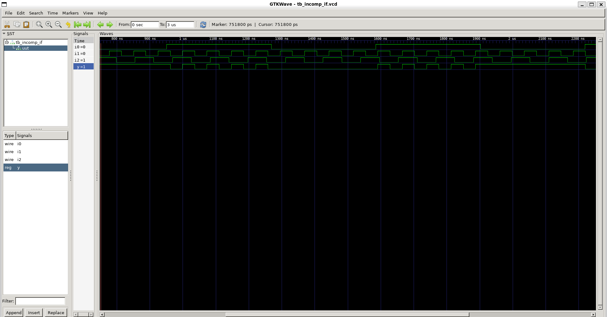
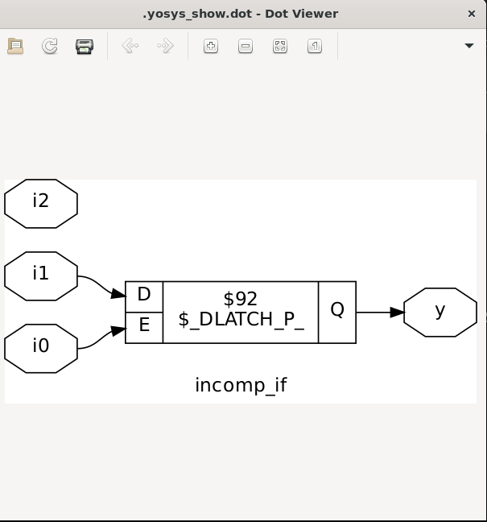
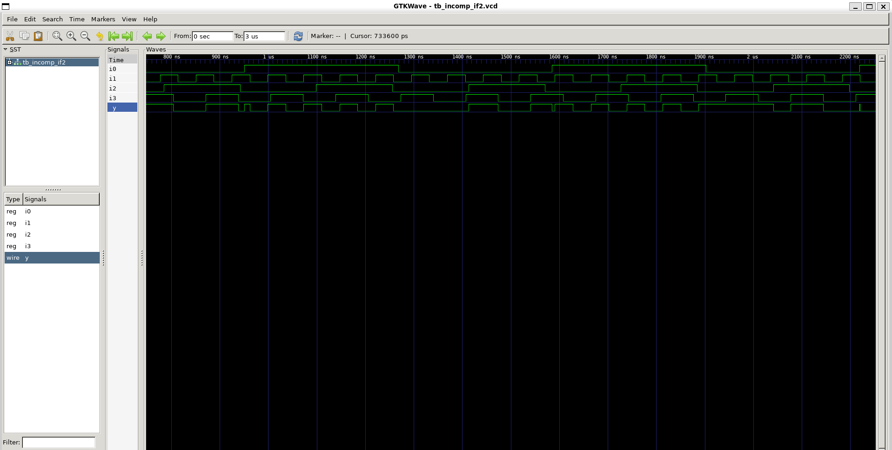
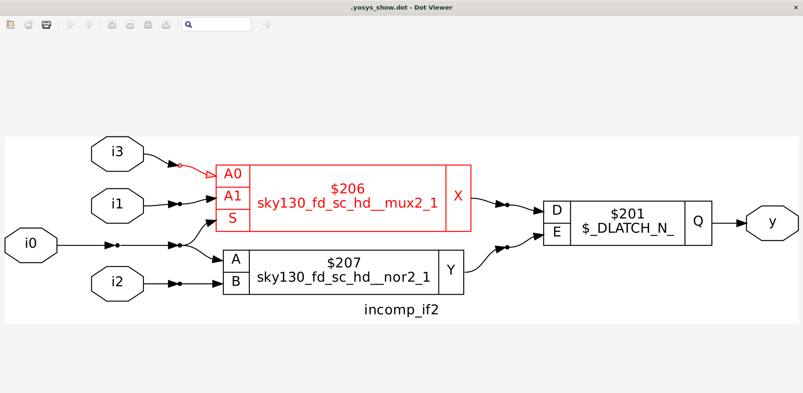

# Day-5 – If Constructs


---

## ✨ What is an `if` Construct?

`if` constructs in Verilog allow **conditional execution** of code inside `always` blocks:

```verilog
if (cond1)
    // do something
else if (cond2)
    // do something else
else
    // default action
```

* `if` → first condition
* `else if` → second (or more) condition
* `else` → default action if none match

---

## ⚠️ Danger: Inferred Latches

* If an `if` or `if-else` **does not cover all cases**, **synthesizers infer a latch** to “remember” the previous value.
* This can **accidentally create memory elements** where you don’t want them.

### Common Problem

* Using incomplete `if` conditions in sequential logic (like a counter) can **inadvertently infer latches**.

*Example – counter scenario:*

```verilog
always @(posedge clk)
begin
    if(reset)
        count <= 0;
    else if(enable)
        count <= count + 1;
    // No else → inferred latch for count
end
```

* **Effect:** `count` holds its previous value implicitly. This may not match intended synchronous design.

---

## 📌 Example 1 – Incomplete `if`

```verilog
module incomp_if (input i0 , input i1 , input i2 , output reg y);
always @(*)
begin
    if(i0)
        y <= i1;
end
endmodule
```

* **Problem:**

  * No `else` clause → `y` will **latch itself** when `i0=0`
  * **Result:** inferred **D-latch**
* **Images:**
  
  

---

## 📌 Example 2 – Incomplete `if-else if`

```verilog
module incomp_if2 (input i0 , input i1 , input i2 , input i3, output reg y);
always @(*)
begin
    if(i0)
        y <= i1;
    else if (i2)
        y <= i3;
end
endmodule
```

* **Problem:**

  * No final `else` → `y` may hold previous value when `i0=0` and `i2=0`
  * **Result:** inferred **D-latch** again
* **Images:**
  
  

---

## ✅ Best Practices

1. **Always cover all conditions** to avoid inferred latches:

```verilog
always @(*)
begin
    if(i0)
        y <= i1;
    else if (i2)
        y <= i3;
    else
        y <= default_value;  // prevents latch
end
```

2. For **combinational logic**, always use **`always @(*)`** and **complete conditions**.
3. For **sequential logic**, ensure **explicit synchronous assignments** and proper `else` handling.

---


